<h1 align=center>Portfolio Project 4</h1>

<h1 align=center>Welcome to Camberley Karting</h1>

## FINAL DESIGN

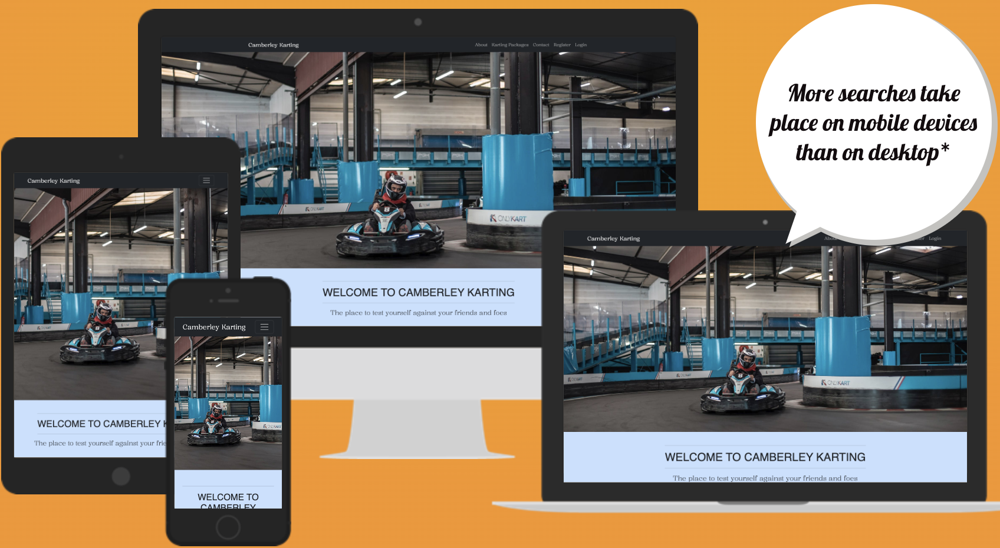 Am  i Responsive(https://amiresponsive.co.uk/)

[Here is a link to the final project](https://camberleykarting-609b5eae883e.herokuapp.com/)

#

## User Experience

### User Stories

## Overview

- The site was created using Django and has full CRUD functionality and an intuitive UI to make the process of booking a Go Karting race event.
- The user is notified of any change to their account or booking with an alert box and email notification where necessary.
- The user can see their past race day bookings and is notified when the booking has been confirmed by the karting company itself..
- The admin users have extra functionality, being able to search race bookings by date and username.

#

### 1. Strategy

To create a website with good UI and UX to promote Camberley Karting where potential customers can login, book and update a race day experience. 

- Project Setup
  - Create the initial Django application
  - Set file structure in accordance with Django common practices
  - Define and create the Database Models
  - Link custom CSS & JavaScript as well as Bootstrap
  - Create a base.html file for the other template to use
  - Link Google Fonts for custom fonts
- UX
  - Include a Favicon logo
  - Install Whitenoise to link up the custom styles
  - View a list of services and cost
  - Style the default allauth pages
  - Create a Homepage
  - Include a contact section
  - Include 403, 500 & 404 pages
  - Allow users and admins to view past race day bookings
  - Display alerts and messages to the user
- Navigation
  - Have a Navbar that is the same across all the pages
  - Have a Footer that is the same across all the pages
- CRUD
  - View upcoming race daybookings
  - Book a race day event
  - Delete a race day booking
  - Enhanced Admin CRUD capabilities
  - Update a race day booking
- Authentication
  - Add user emails
  - Create User Account
  - Setup allauth
  - Allow users and admins to login
  - Send the users email notification when their race day bookings are made, updated, deleted or confirmed
- Validation
  - Include validation in the booking form to make sure bookings are valid and the time is not already taken
- Administration
  - Allow admins to search for date of booking and user
  - Allow users to update their account details including email and password
  - Let admins confirm the race day bookings
- Deployment
  - Cloudinary
  - ElephantSQL
  - Heroku
  - Set Debug to False
- Testing
  - Unit Tests
  - Manual Testing
- Documentation
  - Readme

### 2. Scope

**Agile Methodology**

This project was developed using the Agile methodology. 
All epics and user stories implementation progress was registered using [GitHub](https://github.com/). As the user stories were accomplished, they were moved in the GitHub Kanban board from **ToDo**, to **In Progress**, **Done** and **Not Implemented** lists.
The board can be viewed [here](https://github.com/users/jamieroche1987/projects/10)

**Simple and Intuitive UX**

- Create a responsive navigation menu.
- Create a footer with social links.
- Include an arena location and opening times.
- Ensure that the user is visually notified of all changed to their account for race day booking confirmations.
- Ensure that the user keeps their orientation throughout their website experience.

**Relevant Content** 

- Make sure all the available Race Day services are listed on the site.
- Display the address of the karting arena so users can find it.
- Only allow users to book available time slots.

**Responsiveness** 

- Create a responsive website that works on every device and screen size. 

### 3. Structure

The website is designed with the user in mind and once the user is logged in they have access to 7 different pages:
  
- Landing page
  - About
  - Karting Packages
  - Contact
- Account Home
- Past Bookings- Booking Form
- Booking Details
- Update Email Address
- Change Password

There are also 2 pages available to users who aren't singed in:

- Create Account
- Login

#### Navigation

The navbar along the top of the page is always displayed, allowing the user to easily navigate around the site. The styling is consistent across the site but has different links on display for users that are signed in.
All users will see:

- About
- Karting Packages
- Contact
- Book a Race Day

A user who isn't signed in will see:

- Register
- Login

A user who is signed in will see:

- My Account
- Logout

 

On smaller screen sizes a hamburger menu is displayed with a smooth dropdown effect. 
 

#### Footer

The footer is the same across all the pages and includes:

- Social Media Icons (Facebook, Instagram, Github)
- A copyright statement

The active links have a hover effect where the color slowly changes from gold to white indicating to the user that the link is active. 
 

#### Pages

##### Landing Page

The landing page is divided into 4 sections:

- Hero Image
- About section
- Karting Packages section
- Contact Section

The main landing page has hero image to spark the users interest right away.  
 

Below the hero image is an about section giving the user some information about Camberley karting.  
 

Below the about section is some information on the different karting packages available. Each one can be clicked on and a modal appears with the cost of that package including a 'Book a Race Day' button.
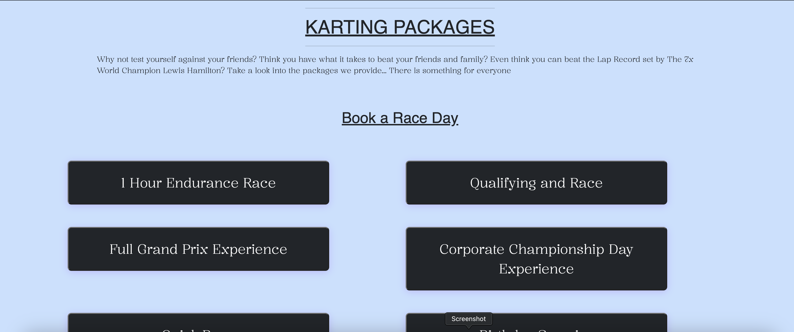 

At the bottom of the landing page is a contact section with address, opening times and a 'Book A Race Day' button.  
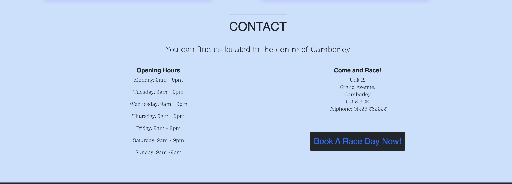 

If the user is logged in, the 'Book A Race Day' button will take them to the booking form. If the user isn't logged in they are redirected to the sign in page before arriving at the booking form.

##### Sign Up Page

This page uses the allauth template as a base with custom design added.
The username and password fields are mandatory but the email is optional. If the user signs up with and includes and email address they will be sent email updates on:

- Creating a booking
- Updating a booking
- Deleting a booking
- An admin confirming a booking

##### Sign In Page

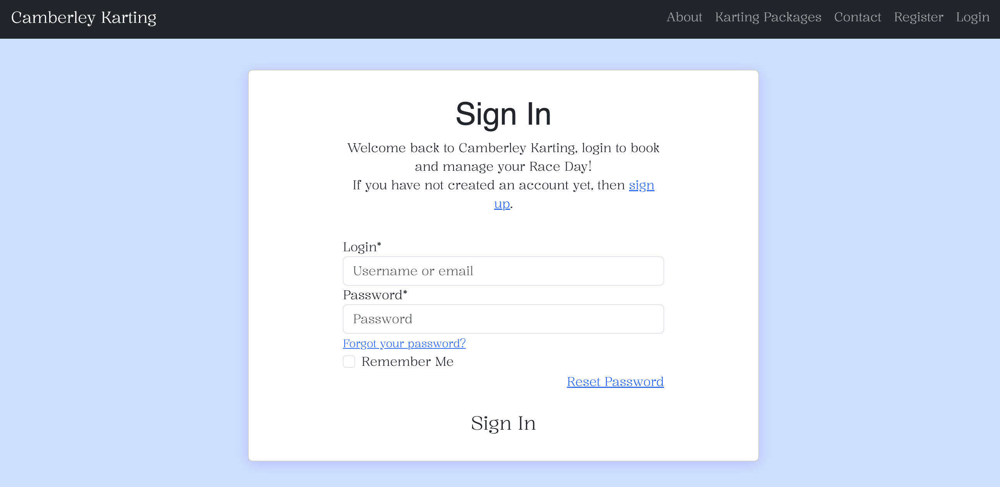 

This page uses the allauth page as a base with custom design added. It allows the user to sign in with either their username or email address (if they provided one).
It also includes aremember me button to make using the site in future easier, and a reset password link that will send the user a password reset email if they included an email when signing up.

##### Account Home Page

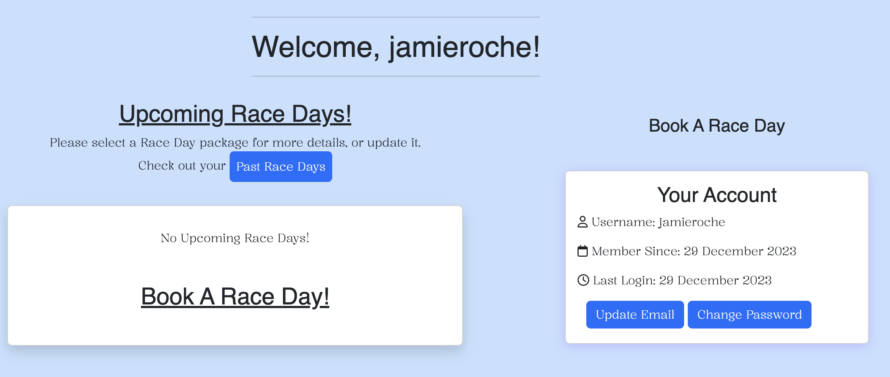 

This page is displayed when the user first logs in, unless they clicked a "Book A Race Day" button before logging in.
On a large screen it is divided into 2 sections:

- Upcoming Race Day bookings
- Your Account

On a mobile device the two sections are stacked with the upcoming bookings at the top of the page.

Each booking is displayed on a card and contains:

- The date
- The karting package
- The time of the booking
- If the user added a message, a message icon
- The confirmation status of the booking

The card has a hover effect to indicate that it is a clickable link taking the user to the details of the booking.

The bookings are displayed in order starting from the one closest to the current date and time, descending as you go down the page. There is a link to view past bookings at the top of the list of bookings.

##### Admin Account Home Page

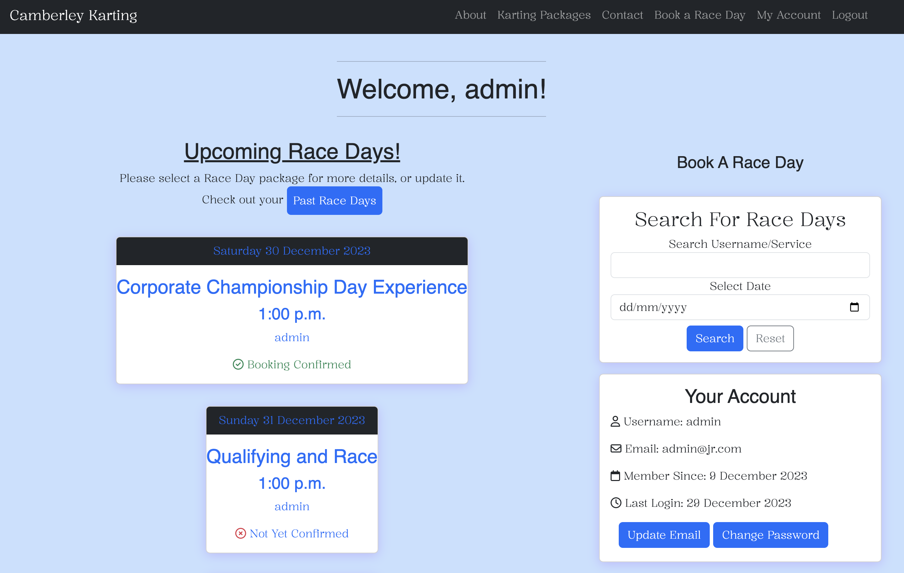 
The account home page for an Admin user has the addition of a Search Bookings panel giving the admin user the ability to search by:

- Date of booking
- Username

If the number of bookings exceeds 25 the page paginates. 

##### Booking Form

The booking form has 4 inputs:

- A date picker
- A Karting package dropdown list
- A time dropdown list
- An optional message box

The form has built in validation alerting the user when an error has been made or the booking cannot be made. Reasons for an error include:

- Booking a date in the past
- Booking a time in the past
- Trying to book a race day at a time that is already booked.

Once a successful booking has been made the user is taken back to the account home page and a success message is displayed at the top that disappears after 5 seconds. The booking will be displayed on the account home page for the user to see, but it will have a 'Not Yet Confirmed' message until an admin logs in and confirms the booking is okay.

##### Booking Detail Page

If a user clicks on a booking from the account home page they are taken to the account detail page that includes:

- Date
- Username (if an admin user)
- Karting package type
- Start time
- End time
- Message (if the user added one)
- The confirmation status
- A confirm booking button (if the user is admin and the booking is not yet confirmed)
- An edit Race Day button
- A cancel Race Day button
- A close button

##### Update Booking Page

If the user clicks on the edit Race Day button on the booking detail page they are taken to a pre-populated booking form containing the details of the booking.
If a confirmed booking as amended the status goes back to 'Not Yet Confirmed' and a confirmation message is displayed to the user.

##### Confirm Delete Booking Page

If the user clicks on the 'Cancel Race Day' button on the booking detail page they are asked if they wish to delete the booking. If they confirm the deletion they are taken back to the account home page and displayed a confirmation message.

#### Sitemap

The project flowcharts for the site structure was created using [LucidChart](https://www.lucidchart.com/).

Sitemap:

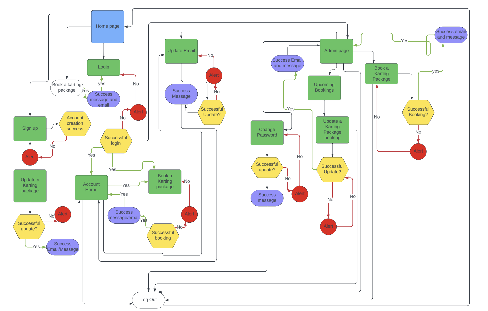 

### 4. Skeleton

**Wireframes**

The wireframes for mobile and desktop were created with [Balsamiq](https://balsamiq.com/) tool and can be viewed 

Here:

Homepage 
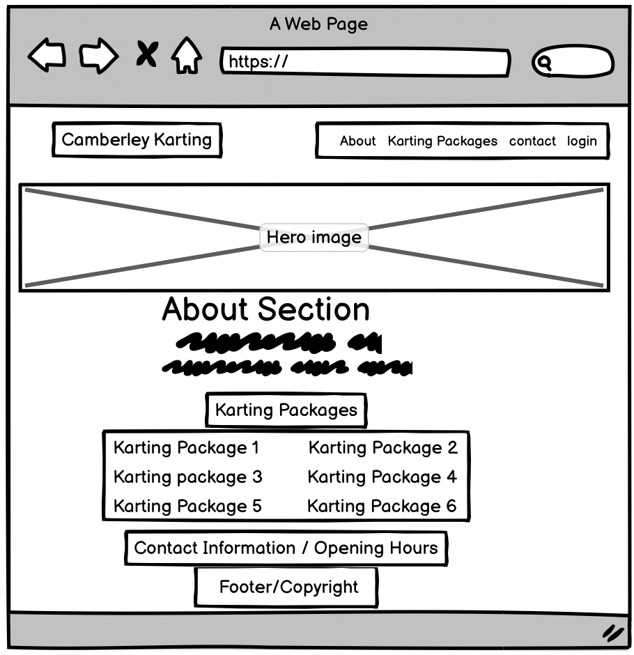 
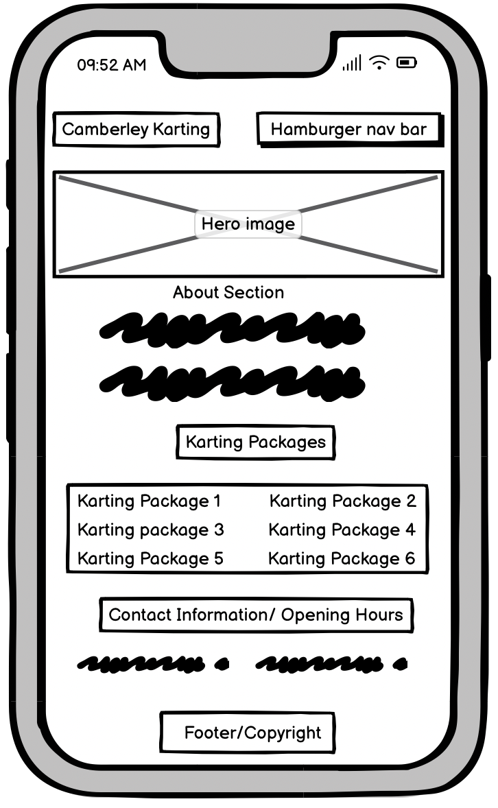 
Login/Create account pages 
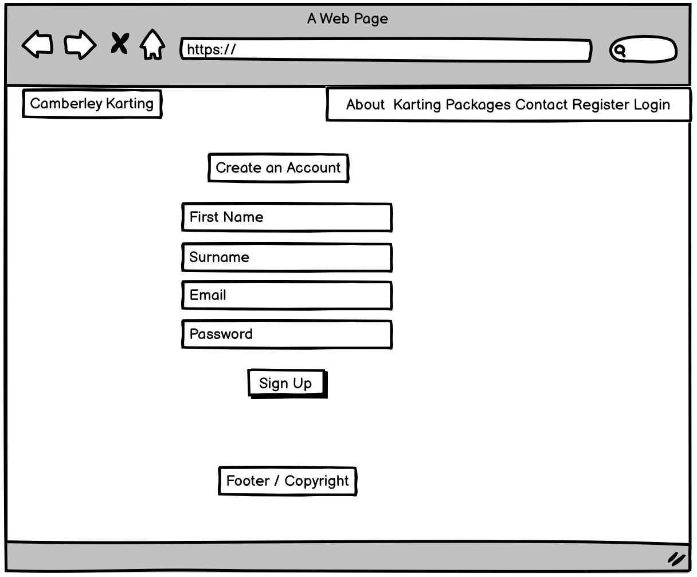 
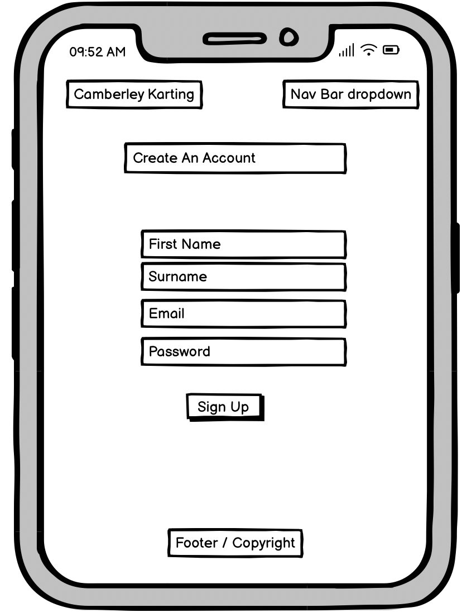 
Book a Race Day 
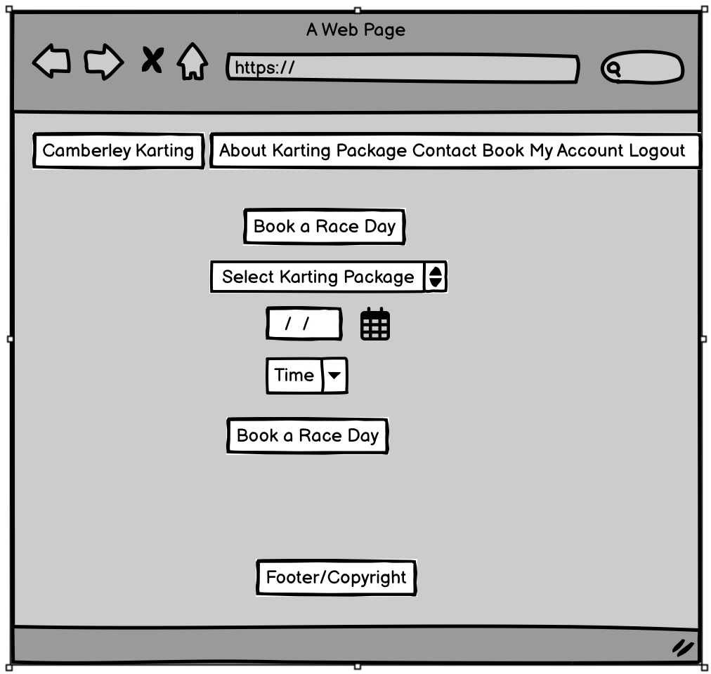 
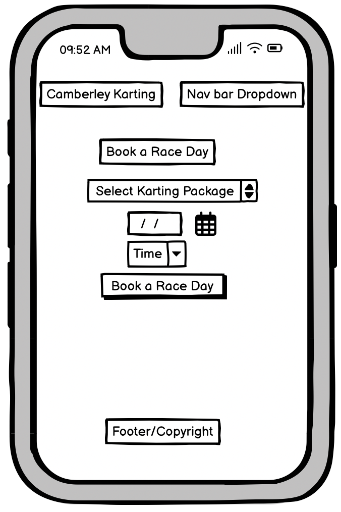 

 
**Database**
The project uses ElephantSQL as PostgreSQL relational database for storing the data.

  
Model

  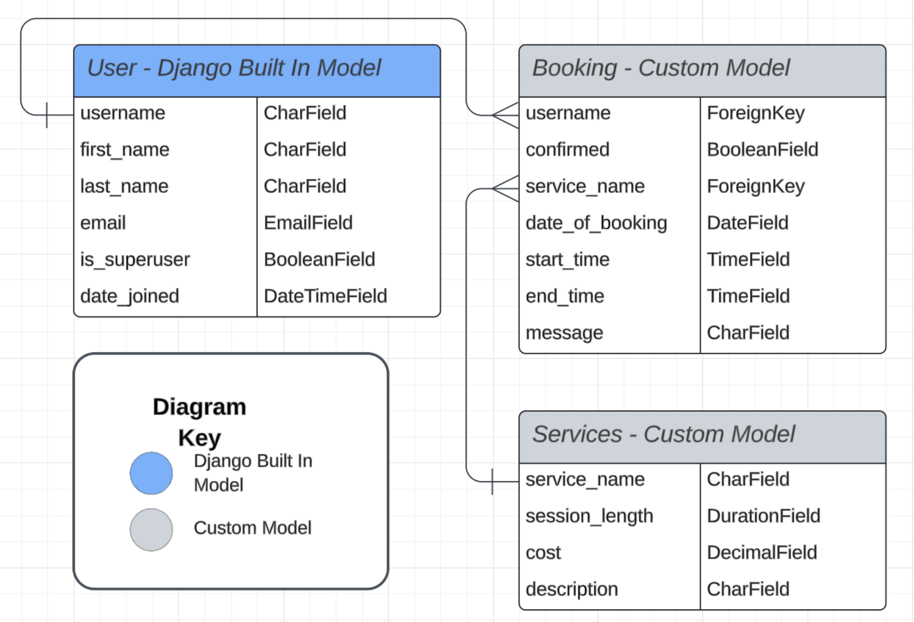 

 

### 5. Surface

#### Color Scheme and Fonts

- The fonts used for this site were imported from [Google Fonts](https://fonts.google.com/):
- 
  - Space Mono for the headings
  - Kalnia for the body

- The colors used were 
 
 rgb(199, 225, 255)
 rgb(188, 188, 255)
 #212529

#### Karting Package Information Modal

On the homepage the Services section includes a list of services taken from the database of services offered. Each services is displayed as a button and when clicked a modal is displayed containing information about the service including:

- Service name
- Cost
- A book karting package button

#### Book a Race Day

The booking form has 4 inputs:

- A date picker
- A Karting package dropdown list
- A time dropdown list
- An optional message box

The form has built in validation alerting the user when an error has been made or the booking cannot be made. Reasons for an error include:

- Booking a date from the past
- Booking a time in the past
- Trying to book a race day package at a time that has already been booked.

Once a successful booking has been made the user is taken back to the account home page and a success message is displayed at the top that disappears after 5 seconds. The booking will be displayed on the account home page for the user to see, but it will have a 'Not Yet Confirmed' message until an admin logs in and confirms the booking is confirmed.

##### Booking List

Each booking is displayed on a card on the account home page and contains:

- The date
- The service
- The time of the booking
- If the user added a message, a message icon
- The confirmation status of the booking

##### Booking Detail Page

If a user clicks on a booking from the account home page they are taken to the account detail page that includes:

- Date
- Username (if an admin user)
- Package type
- Start time
- End time
- Message (if the user added one)
- The confirmation status
- A confirm booking button (if the user is admin and the booking is not yet confirmed)
- An edit race day button
- A cancel race day button
- A close button

##### Update Booking Page

If the user clicks on the edit race day button on the booking detail page they are taken to a pre-populated booking form containing the details of the booking.
If a confirmed booking as amended the status goes back to 'Not Yet Confirmed' and a confirmation message is displayed to the user.

##### Confirm Delete Booking Page

If the user clicks on the 'Cancel race day' button on the booking detail page they are asked if they wish to delete the booking. If they confirm the deletion they are taken back to the account home page and displayed a confirmation message.

##### Admin Search Panel

Admin users have a Search Bookings panel on the account home page giving the admin user the ability to search by:

- Date of booking
- Username

##### Update Email

Users can update the email address attached to their account from the account panel in the account home page. They can:

- Add an email address
- Remove an email address
- Make an email address primary

##### Change Password

Users can change their password from the account panel in the account home page.

### Potential Future Features

- Allow admin users to edit the karting packages from the account home rather than from the django backend panel
- Social media signup
- Add profile section where users can add a profile picture and update their username
- Add a description to the packages for the users to have more information about what the packages include.

## Responsive Layout and Design

The bootstrap grid system and flexbox was used to create a fully responsive layout and testing on multiple screen sizes and devices was carried out to make sure it each page looks good in many settings.

**Tested devices:**

- I have tested responsiveness and functionality on the following devices and browsers:
  
  - Android:

  - Samsung Galaxy Tab A

  - Apple:

    - Ipad mini
    - Iphone 14 pro max
  
  - Desktops/laptops:

  - HP Pavillion Laptop

## Tools Used

- [GitHub](https://github.com/) for hosting the source code of the program and version control
- [Codeanywhere](https://codeanywhere.com/) for writing and testing the code
- [Heroku](https://dashboard.heroku.com/) used for deploying the project
- [ElephantSQL](https://www.elephantsql.com/) for the PostgreSQL database
- [Balsamiq](https://balsamiq.com/wireframes/) for creating the wireframes
- [LucidChart](https://www.lucidchart.com/) for creating the Flowchart
- [Font Awesome](https://fontawesome.com/) for the site's icons
- [Bootstrap4](https://getbootstrap.com/) for the initial styling of of the site
- [Google Fonts](https://fonts.google.com/) for the typography
- [Code Institute Pylint](https://pep8ci.herokuapp.com/) for validating the python code
- [HTML - W3C HTML Validator](https://validator.w3.org/#validate_by_uri+with_options) for validating the HTML
- [CSS - Jigsaw CSS Validator](https://jigsaw.w3.org/css-validator/#validate_by_uri) for validating the CSS
- [Chrome Dev Tools](https://developer.chrome.com/docs/devtools/) for debugging the project
- [W.A.V.E.](https://wave.webaim.org/) for testing accessibility
- [Cloudinary](https://cloudinary.com/) for storing static data
- [Chrome LightHouse extension](https://developer.chrome.com/docs/lighthouse/overview/) for testing performance
- [Favicon.io](https://favicon.io/) for converting the sites favicon

### Python packages

- [Django](https://www.djangoproject.com/) was used as the framework for the site.
- [Allauth](https://django-allauth.readthedocs.io/) for the login authentication.
- [Crispy Forms](https://django-crispy-forms.readthedocs.io/) for help styling the forms.
- [Cloudinary](https://cloudinary.com/) for hosting the images.
- [Gunicorn](https://gunicorn.org/) for handling the HTTP requests in production.
- [Psycopg2](https://www.psycopg.org/) for aiding communication between Django and PostgresSQL
- [Formtools](https://django-formtools.readthedocs.io/) for additional form utilities.
- [Whitenoise](http://whitenoise.evans.io/en/stable/) for deploying the static files to Heroku.

A full list of the requirements and the versions used can be found in the requirements.txt file.

To create the requirements.txt file I ran the following command: 
`pip3 freeze > requirements.txt`

To create a superuser the following command should be run:  
`python3 manage.py createsuperuser`

To run the migrations to the database the following commands are used: 
`python3 manage.py makemigrations`  
`python3 manage.py migrate`

To collect the static files for deployment run the following command:  
`python3 manage.py collectstatic`

## Testing and Code validation

Tests were written using Django's test suite and can be found in the following locations:

- booking_system > test_forms.py
- booking_system > test_views.py
- home > test_views.py

As well as automated tests you can find details on user testing in [TESTING.md](TESTING.md).

## Bugs

- Static files were not being issued on Heroku, I needed to install and setup whitenoise.
- On deployment, the email confirmations were causing an internal server error the user. I needed to give Heroku assess to the email password.
- Adding whitenoise to MIDDLEWARE caused the project to break. It needed to be installed.
- The nested if statements in the account home page was causing the searchbox to be hidden. The statements needed rearranging.
- The custom 400, 403 and 500 pages were not showing up on deployment. Once I removed the  block inside the html template they worked.
- The DeleteBookingView was not sending a confirmation email to the user. I needed to put the code in the delete method not the form_valid method.
- Adding the searchbox to the admin panel was causing a user to not be able to view the account home page. I all code related to the search panel inside an if statement to fix the error.
- - When a booking was updated a new one was created and the old one was still in the database. The url needed to be removed from the form button so the form can complete it's function rather than creating a new booking.

## Deployment

Camberley Karting is deployed using Heroku

Heroku Deployment steps: 

 1. Ensure all dependencies are listed within the requirements.txt file

 Within the terminal in codeanywhere type `pip3 --local freeze > requirements.txt`, and a list with all requirements will be created to be read by Heroku.

 2. Setting up Heroku

- NB Due to security issues connecting github directly to heroku (at the time this project was deployed),
    first you must log into your heroku account via the terminal in gitpod (more info on this further down).

    2.1 Next, navigate to the [Heroku](https://www.heroku.com/) website

    2.2 Login to Heroku

    2.3 Click on `New` (top right) and Create a new app

    2.4 Choose a project name and set your location

    2.5. Navigate to the `Resources` tab

    2.6. In the `Add ons` section, search for Heroku Postgres and select it on the list
  - A pop up will appear, select, 'Hobby Dev' and click `Submit order form`

    2.7.1. Next, You would usually navigate to the `deploy` tab;
  - Click on connect to Github
  - Search for the repository named Camberley Karting
  - And connect heroku to Github.
    2.7.2. But, as mentioned above this is not possible for the time being.
  - So instead, In order to connect gitpod to heroku type:
    - `$ heroku login -i`
    - Then enter your heroku credentials,
    - Now you are logged into heroku in Codeanywhere
    - Once all code is commited and pushed to Github, simply push code from Codeanywhere to heroku using the command:
    - Heroku will start the build process, this can be viewed under the `Activity` tab
    - Once the build process has completed, navigate to `Open App`
    - The app should now be ready to view

    2.8. Navigate to the settings tab

    2.9.  Click on Config Vars, and add Cloudinary, Database URL (from Heroku-Postgres) and Secret key

Forking the GitHub Repository 

- By forking the GitHub Repository, you will be able to make a copy of the original repository on your own GitHub account, allowing you to view and/or make changes without affecting the original repository by using the following steps:

  - Log in to your own GitHub and locate the GitHub Repository you wish to fork
  - At the top of the Repository (not top of page), just above the "Settings" button on the menu, locate the "Fork" button.
  - You should now have a copy of the original repository in your GitHub account

- Making a Local Clone

  - Log in to your own GitHub and locate the GitHub Repository
  - Under the repository name, click "Clone or download"
  - To clone the repository using HTTPS, under "Clone with HTTPS", copy the link
  - Open Git Bash
  - Change the current working directory to the location where you want the cloned directory to be made
  - Type git clone, and then paste the URL you copied in Step 3

 $ git clone <https://github.com/jamieroche1987/Camberley-Karting>

Press Enter. Your local clone will be created

## Images

- I sourced the hero image for the home page from <https://www.pexels.com/>

## Credits and references

### Code

  - W3schools
  - Stack overflow
  - The Code Institute CodeStar walkthrough project was a great help in getting used to Django. The JS was from the walkthrough project.
    - - Django's docs have been invaluable:
  - [Date](https://docs.djangoproject.com/en/3.2/ref/templates/builtins/#date)
  - [Time](https://docs.python.org/3/library/time.html)
  - [Email](https://docs.djangoproject.com/en/3.2/topics/email/#email-backends)
  - - Help with Bootstrap from their [documentation](https://getbootstrap.com)
 

## Acknowledgements

- My partner Runa Brandes-Roche who has taken the time to look and advice me on the areas that need improving or amending. Also putting up with my stress levels when things have got tough when doing this project. Thank you Runa for your continued support.

- John for his guidance and help whenever i required it. Helping me with coding errors all over the project. His time and patiences has been something i truly appreciate. Thnak you again John for all your help during this project.

- All the Tutors at tutor support that have guided me when ive got stuck and helped me solve the issues i was having.

- The Code Institute Slack community who have been there to help and give suggestions and feedback.
